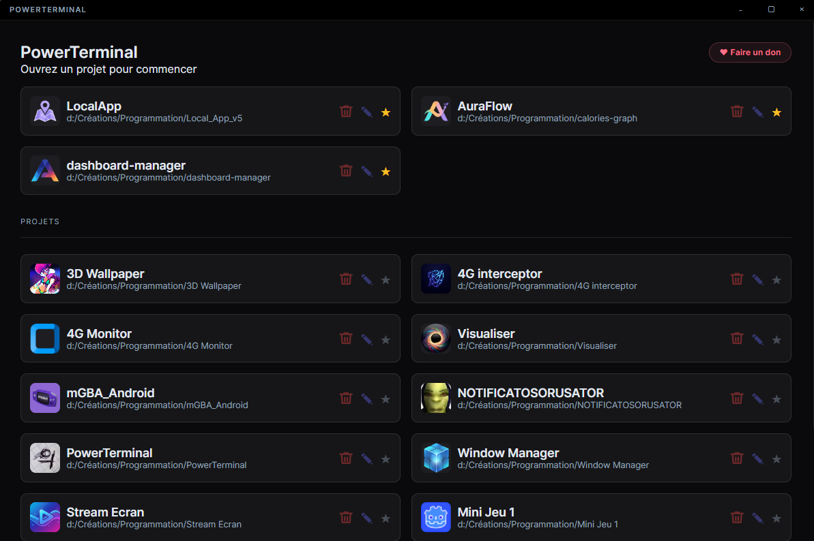
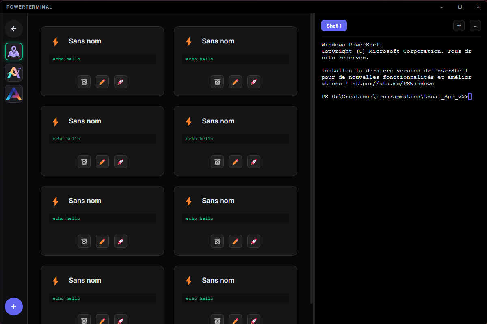

# PowerTerminal

Un terminal de développement contextuel sous Windows, construit avec Electron + xterm.js.

Chaque projet a son propre espace : terminal intégré, commandes rapides personnalisables, logo, et raccourcis favoris.

  

---

## Aperçu

| Accueil | Dashboard projet |
|---------|-----------------|
|  |  |

> *Accueil : liste des projets avec favoris. Dashboard : commandes rapides + terminal intégré.*

---

## Fonctionnalités

- **Multi-projets** — ajout manuel de projets via sélecteur de dossier natif
- **Terminal intégré** — PowerShell via node-pty + xterm.js avec support multi-onglets
- **Commandes rapides** — boutons personnalisables par projet (emoji, nom, commande shell)
- **Favoris** — accès rapide aux projets épinglés dans la barre latérale
- **Personnalisation** — nom affiché, logo, dossier racine par projet
- **Disposition adaptative** — layout horizontal ou vertical selon la taille de fenêtre
- **Config persistante** — toutes les données sont stockées dans `config.json` à la racine

---

## Stack

| Composant | Techno |
|-----------|--------|
| Shell app | Electron 31 |
| Terminal | xterm.js 5 + node-pty |
| Build | Vite + vite-plugin-electron |
| Packaging | electron-builder (portable) |
| Config | `config.json` (JSON natif) |

---

## Installation

```bash
npm install
npm run dev
```

> node-pty nécessite une compilation native. Avoir Python et les Build Tools Visual Studio installés.

---

## Build

```bash
npm run build
```

Génère un exécutable portable Windows dans `/release`.

---

## Configuration

Le fichier `config.json` est créé automatiquement à la racine du projet au premier ajout de projet. Il contient :

```json
{
  "rootPath": "C:/Users/...",
  "projectMetadata": {
    "C:/mon/projet": {
      "displayName": "Mon Projet",
      "customRoot": "C:/mon/projet",
      "isFavorite": false,
      "logoPath": "C:/mon/projet/logo.png",
      "customCommands": [
        {
          "emoji": "🚀",
          "label": "Dev",
          "command": "npm run dev"
        }
      ]
    }
  }
}
```

> `config.json` est ignoré par git — chaque utilisateur a sa propre configuration locale.

---

## Structure

```
PowerTerminal/
├── src/
│   ├── main/
│   │   ├── main.js        # Process principal Electron (IPC, PTY, config)
│   │   └── preload.js     # Bridge contextIsolation
│   └── renderer/
│       ├── js/app.js      # UI, state, terminal, projets
│       └── style/main.css
├── index.html
├── config.json            # Config locale (gitignored)
├── logo.ico
├── package.json
└── vite.config.js
```
